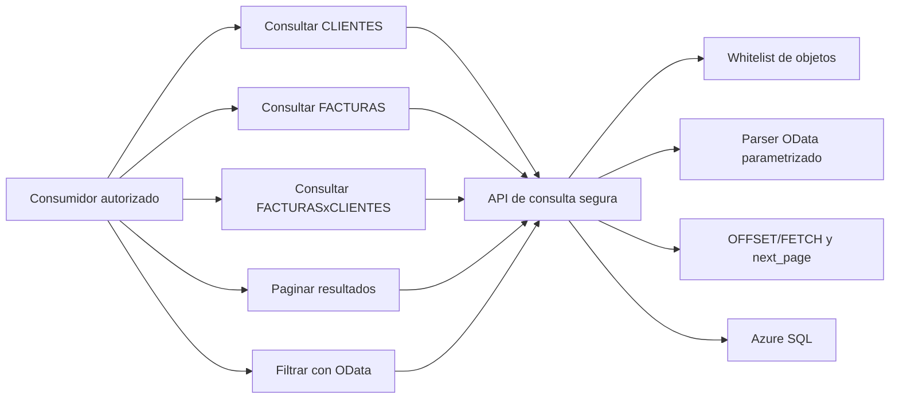
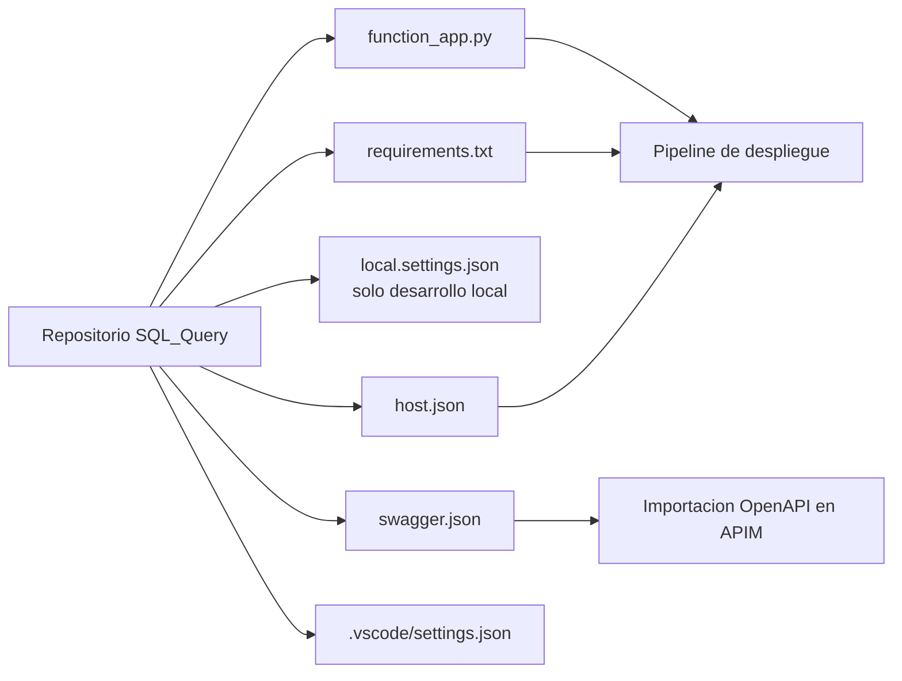
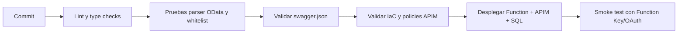
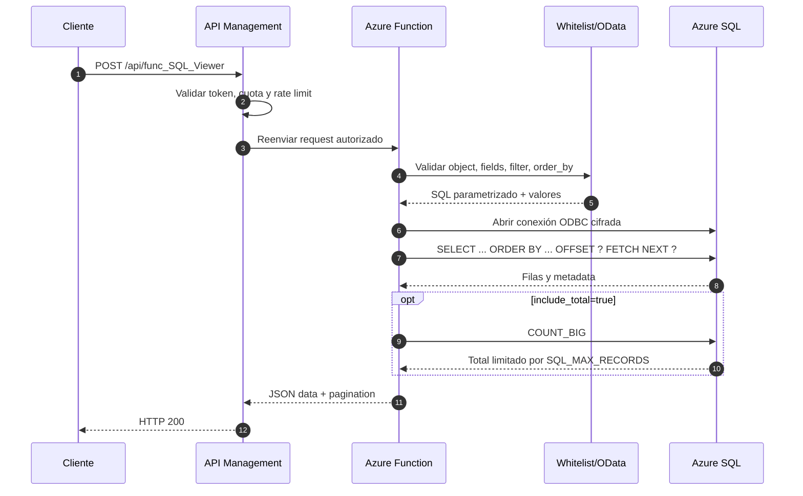
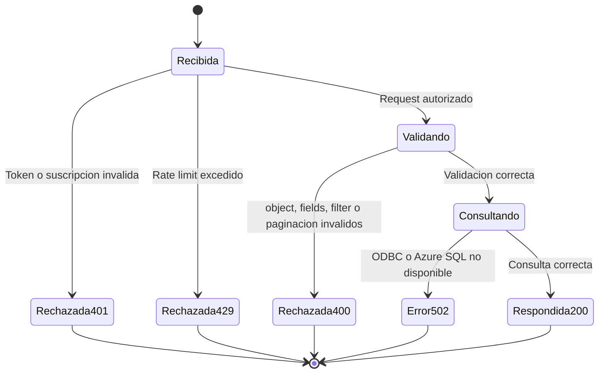
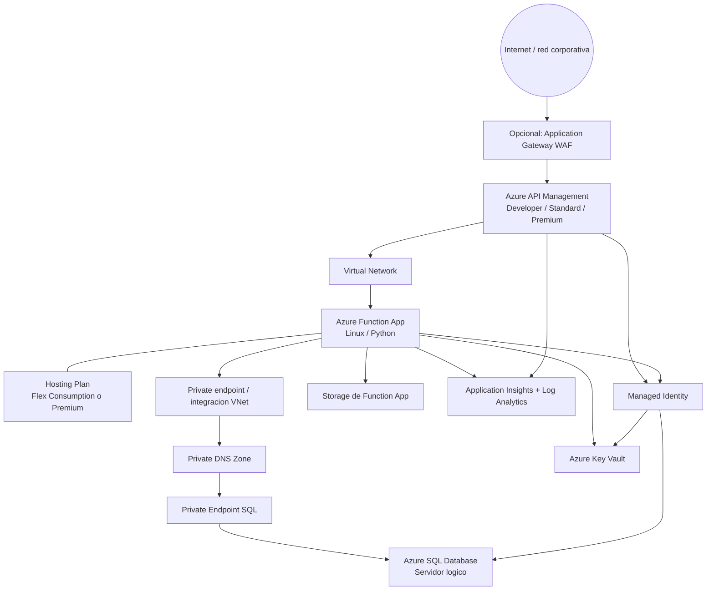

# Arquitectura punta a punta: SQL Query API

> Estado: documento de arquitectura y validación de infraestructura.
>
> Alcance: Azure API Management -> Azure Functions -> Azure SQL Database.
>
> La solución actual contiene la Function App, el contrato OpenAPI y la conexión ODBC. Los recursos de APIM, Azure Functions y Azure SQL deben validarse en la suscripción y entorno objetivo.

## 1. Resumen

La solución expone una API de consulta de solo lectura. Azure API Management publica y protege el contrato, Azure Functions valida el objeto permitido, los campos, el filtro OData y la paginación, y Azure SQL ejecuta la consulta mediante ODBC Driver 18.

El cliente no envía schema ni SQL arbitrario. El parámetro `object` se resuelve contra una whitelist y el schema se aplica internamente:

```json
{
  "object": "CLIENTES",
  "parameters": ["ID", "Nombre", "Enabled"],
  "filter": "Enabled eq true",
  "order_by": "ID",
  "limit": 50,
  "offset": 0,
  "include_total": false
}
```

La configuración esperada de objetos es:

```text
SQL_ALLOWED_OBJECTS=FACTURAS,CLIENTES,FACTURASxCLIENTES
SQL_OBJECT_SCHEMA=dbo
```

## 2. Vista 4+1

El modelo 4+1 se expresa con cuatro vistas arquitectónicas y una vista de escenarios:

- **Escenarios:** casos de uso que validan la arquitectura.
- **Vista lógica:** responsabilidades y contratos de los componentes.
- **Vista de desarrollo:** módulos y artefactos del repositorio.
- **Vista de procesos:** flujo de una petición y controles operativos.
- **Vista física:** despliegue en Azure y sus límites de red/identidad.

---

## 3. Vista de escenarios (+1)

Los escenarios son la prueba de que cada componente tiene una responsabilidad comprobable.



### Casos de uso

| ID | Caso de uso | Entrada | Resultado esperado |
|---|---|---|---|
| UC-01 | Consultar clientes | `object=CLIENTES` | Campos seleccionados desde `dbo.CLIENTES`. |
| UC-02 | Consultar facturas | `object=FACTURAS` | Campos seleccionados desde `dbo.FACTURAS`. |
| UC-03 | Consultar relación | `object=FACTURASxCLIENTES` | Proyección combinada desde el objeto autorizado. |
| UC-04 | Filtrar | `filter=Enabled eq true` | SQL parametrizado, sin concatenar valores del cliente. |
| UC-05 | Paginar | `limit`, `offset` | Respuesta con `limit`, `offset`, `next_page` y `has_more`. |
| UC-06 | Contar resultados | `include_total=true` | Conteo opcional con `COUNT_BIG`. |

---

## 4. Vista lógica

```mermaid
flowchart TB
    Client[Cliente autorizado]
    APIM[Azure API Management\nAPI, policies, rate limit]
    Function[Azure Function\nfunc_SQL_Viewer]
    Auth[Autenticacion y autorizacion]
    Whitelist[Whitelist\nFACTURAS | CLIENTES | FACTURASxCLIENTES]
    Fields[Validador de campos\nparameters]
    OData[Parser OData\nfilter -> SQL parametrizado]
    Paging[Paginacion\nlimit / offset / next_page]
    ODBC[pyodbc + ODBC Driver 18]
    SQL[Azure SQL Database]
    Views[Indexed views / proyecciones materializadas]

    Client --> APIM
    APIM --> Auth
    APIM --> Function
    Function --> Whitelist
    Function --> Fields
    Function --> OData
    Function --> Paging
    Function --> ODBC
    ODBC --> SQL
    SQL --> Views

    Views --> V1[dbo.IV_CLIENTES_QUERY]
    Views --> V2[dbo.IV_FACTURAS_QUERY]
    Views --> V3[dbo.IV_FACTURAS_CLIENTES_QUERY]
```

### Responsabilidades

| Componente | Responsabilidad | Control principal |
|---|---|---|
| API Management | Exponer el API, aplicar autenticación, cuotas, rate limiting, logging y versionado. | Suscripción, JWT/OAuth2 o mTLS, policies. |
| Azure Function | Validar request, whitelist, campos, OData y paginación. | No acepta schema ni SQL arbitrario. |
| `pyodbc` / ODBC 18 | Crear la conexión y ejecutar SQL parametrizado. | Timeouts, pooling y cifrado. |
| Azure SQL | Persistir datos y servir proyecciones optimizadas. | RBAC, firewall privado, auditoría y least privilege. |
| Indexed views | Precalcular proyecciones de cada caso de uso. | `SCHEMABINDING`, índice único y validación de frescura. |

---

## 5. Vista de desarrollo



### Artefactos actuales

| Artefacto | Uso |
|---|---|
| `function_app.py` | Endpoint SQL, whitelist, parser OData, ODBC y paginación. |
| `swagger.json` | Contrato OpenAPI para APIM, Swagger Editor y pruebas. |
| `requirements.txt` | `azure-functions` y `pyodbc`. |
| `host.json` | Configuración del runtime de Azure Functions. |
| `local.settings.json` | Configuración local; no debe versionarse ni contener secretos reales. |

### Flujo de entrega



---

## 6. Vista de procesos



### Estados de error



### Concurrencia y límites

- API Management limita solicitudes por consumidor y protege Azure Functions de picos.
- Azure Functions usa conexiones ODBC con pooling, timeout de conexión y timeout de operación.
- `SQL_MAX_RECORDS` limita el recorrido lógico máximo por petición.
- `limit` controla el tamaño de página y `offset` la posición.
- `include_total` debe ser opcional porque `COUNT_BIG` agrega costo.
- Azure SQL debe dimensionarse para la concurrencia esperada y las consultas de las indexed views.

---

## 7. Vista física de infraestructura



### Componentes de Azure a validar

| Componente | Configuración objetivo | Validación |
|---|---|---|
| API Management | API importada desde `swagger.json`, backend Function, policies de seguridad y rate limit. | URL pública, backend health, subscription/JWT, 4xx/5xx y throttling. |
| Function App | Python runtime, `pyodbc`, ODBC Driver 18, managed identity, settings protegidos. | Function discovery, health, logs y prueba end-to-end. |
| Azure SQL | Base de datos, firewall privado, roles de identidad y indexed views. | Conectividad privada, `SELECT` autorizado y latencia. |
| Storage | Cuenta requerida por Functions, preferentemente ZRS según región. | Blob/queue/table reachable y diagnóstico healthy. |
| Key Vault | Secretos solo si no se usa identidad administrada completa. | Access policies/RBAC y rotación. |
| Monitor | Application Insights, métricas APIM, Function y SQL. | Correlación por `trace-id`, errores, duración y dependencias. |

---

## 8. SQL: vistas materializadas por caso de uso

### Nota de implementación

Azure SQL Database no usa una sentencia `CREATE MATERIALIZED VIEW` como otros motores. El equivalente operativo son las **indexed views**. Para que una vista sea materializada por el motor debe cumplir las restricciones de SQL Server, incluyendo normalmente:

- `WITH SCHEMABINDING`.
- Referencias con schema explícito.
- Expresiones deterministas.
- Índice único clustered obligatorio como primera materialización.
- Revisión de costo y mantenimiento sobre `INSERT/UPDATE/DELETE` de las tablas base.

Los nombres siguientes son el diseño propuesto y deben ajustarse a las columnas reales de cada tabla.

### 8.1 `dbo.IV_CLIENTES_QUERY`

**Caso de uso:** UC-01, consulta de clientes.

**Objeto autorizado:** `CLIENTES`.

**Proyección sugerida:** `ID`, `Nombre`, `Enabled`, `Bloqueo`, `Saldo`.

```sql
CREATE VIEW dbo.IV_CLIENTES_QUERY
WITH SCHEMABINDING
AS
    SELECT
        c.ID,
        c.Nombre,
        c.Enabled,
        c.Bloqueo,
        c.Saldo
    FROM dbo.Clientes AS c;
GO

CREATE UNIQUE CLUSTERED INDEX CIX_IV_CLIENTES_QUERY
    ON dbo.IV_CLIENTES_QUERY (ID);
GO
```

**Validar:** `ID` debe ser único o reemplazarse por una clave compuesta; confirmar tipos y nombres reales.

### 8.2 `dbo.IV_FACTURAS_QUERY`

**Caso de uso:** UC-02, consulta de facturas.

**Objeto autorizado:** `FACTURAS`.

**Proyección sugerida:** definir con el esquema real de `dbo.Facturas`, por ejemplo identificador, fecha, cliente, estado y total.

```sql
-- Sustituir columnas por las existentes en dbo.Facturas.
CREATE VIEW dbo.IV_FACTURAS_QUERY
WITH SCHEMABINDING
AS
    SELECT
        f.ID,
        f.Fecha,
        f.ClienteID,
        f.Estado,
        f.Total
    FROM dbo.Facturas AS f;
GO

CREATE UNIQUE CLUSTERED INDEX CIX_IV_FACTURAS_QUERY
    ON dbo.IV_FACTURAS_QUERY (ID);
GO
```

**Validar:** el esquema actual de `FACTURAS` debe confirmar `ID`, `Fecha`, `ClienteID`, `Estado` y `Total` antes de ejecutar este script.

### 8.3 `dbo.IV_FACTURAS_CLIENTES_QUERY`

**Caso de uso:** UC-03, consulta de facturas relacionadas con clientes.

**Objeto autorizado:** `FACTURASxCLIENTES`.

```sql
-- Sustituir nombres por las columnas reales y garantizar unicidad de la clave.
CREATE VIEW dbo.IV_FACTURAS_CLIENTES_QUERY
WITH SCHEMABINDING
AS
    SELECT
        f.ID AS FacturaID,
        c.ID AS ClienteID,
        c.Nombre AS ClienteNombre,
        f.Fecha,
        f.Total,
        f.Estado
    FROM dbo.Facturas AS f
    INNER JOIN dbo.Clientes AS c
        ON c.ID = f.ClienteID;
GO

CREATE UNIQUE CLUSTERED INDEX CIX_IV_FACTURAS_CLIENTES_QUERY
    ON dbo.IV_FACTURAS_CLIENTES_QUERY (FacturaID, ClienteID);
GO
```

**Validar:** la combinación `(FacturaID, ClienteID)` debe ser única; confirmar que el join sea determinista y que las tablas base soporten el costo de mantenimiento.

### Mapeo de whitelist a vistas

| `object` recibido | Objeto lógico | Vista indexed propuesta | Caso de uso |
|---|---|---|---|
| `CLIENTES` | Clientes | `dbo.IV_CLIENTES_QUERY` | UC-01 |
| `FACTURAS` | Facturas | `dbo.IV_FACTURAS_QUERY` | UC-02 |
| `FACTURASxCLIENTES` | Facturas + clientes | `dbo.IV_FACTURAS_CLIENTES_QUERY` | UC-03 |

> Recomendación: cuando las vistas estén creadas y validadas, apuntar la whitelist directamente a las vistas en vez de permitir consultas sobre tablas base. Así se limita la superficie de lectura y se estabiliza el plan de consulta.

---

## 9. Seguridad y secretos

- No almacenar credenciales SQL reales en `local.settings.json` versionado.
- Usar Managed Identity de la Function App para Azure SQL.
- Conceder únicamente `SELECT` sobre las vistas autorizadas.
- Mantener la API SQL detrás de APIM en producción.
- Aplicar validación de `object`, campos, `filter` y `order_by` en la Function.
- Configurar Private Endpoint para Azure SQL y restringir firewall.
- Rotar inmediatamente cualquier contraseña que haya sido expuesta durante pruebas.

Ejemplo de permisos mínimos una vez creadas las vistas:

```sql
CREATE USER [mi-function-app] FROM EXTERNAL PROVIDER;
GRANT SELECT ON OBJECT::dbo.IV_CLIENTES_QUERY TO [mi-function-app];
GRANT SELECT ON OBJECT::dbo.IV_FACTURAS_QUERY TO [mi-function-app];
GRANT SELECT ON OBJECT::dbo.IV_FACTURAS_CLIENTES_QUERY TO [mi-function-app];
```

---

## 10. Checklist de validación de infraestructura

### APIM

- [ ] Importar y validar `swagger.json`.
- [ ] Configurar backend hacia Function App.
- [ ] Activar autenticación y suscripción.
- [ ] Aplicar rate limit y cuota por consumidor.
- [ ] Configurar logging y correlation ID.
- [ ] Confirmar que no se expone directamente la URL de la Function en producción.

### Azure Functions

- [ ] Runtime Python compatible.
- [ ] `pyodbc` instalado durante build.
- [ ] ODBC Driver 18 disponible en el runtime.
- [ ] Managed Identity habilitada.
- [ ] `SQL_ALLOWED_OBJECTS` y `SQL_OBJECT_SCHEMA` configurados.
- [ ] `SQL_MAX_RECORDS`, timeout y logging definidos.
- [ ] Storage de Functions saludable.

### Azure SQL

- [ ] Confirmar existencia de `dbo.Clientes`, `dbo.Facturas` y relaciones.
- [ ] Crear y validar las tres indexed views.
- [ ] Crear índices únicos clustered.
- [ ] Otorgar solo `SELECT` a la identidad de la Function.
- [ ] Configurar Private Endpoint/firewall.
- [ ] Medir latencia con y sin `include_total`.
- [ ] Revisar mantenimiento de vistas ante escrituras.

### Pruebas end-to-end

- [ ] `object=CLIENTES` devuelve solo campos solicitados.
- [ ] `object=FACTURAS` devuelve solo campos solicitados.
- [ ] `object=FACTURASxCLIENTES` devuelve la proyección combinada.
- [ ] Un objeto fuera de whitelist devuelve `400`.
- [ ] Un schema enviado por el cliente devuelve `400`.
- [ ] Un filtro no permitido devuelve `400`.
- [ ] La respuesta contiene `limit`, `offset`, `next_page` y `has_more`.
- [ ] APIM registra la traza completa sin registrar secretos.
